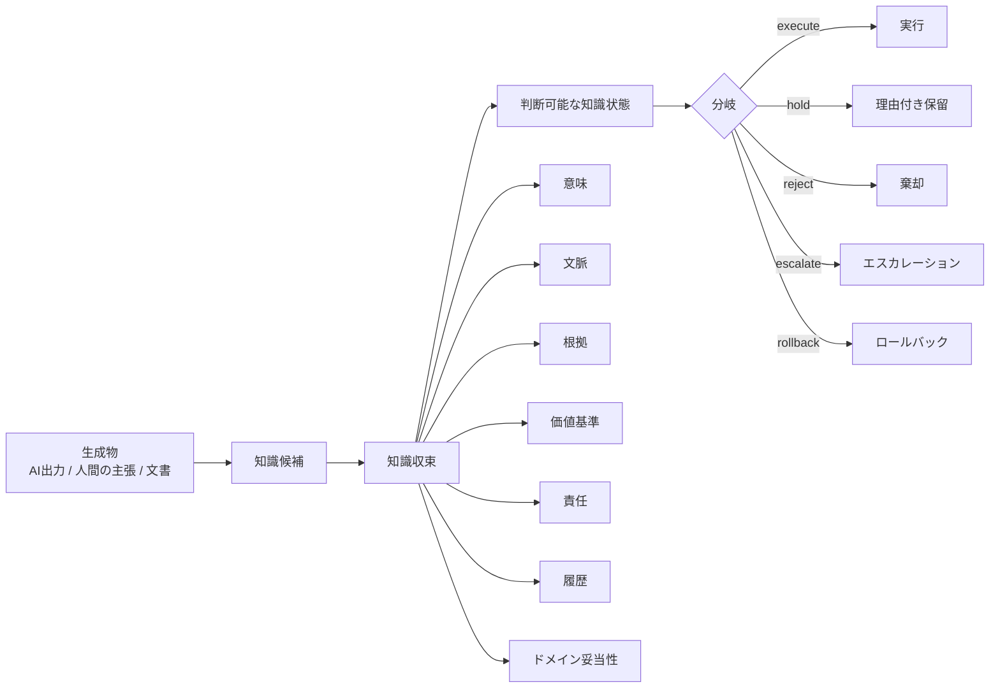

# Knowledge Convergence / 知識収束学

**タグライン:** 生成物を、判断可能な知識状態へ変換するための理論と仕様。

知識収束学は、AIや人間が生成した情報・主張・根拠・判断・運用フィードバックを、組織が説明し、統治し、実行できる知識状態へ変換するための理論および工学的フレームワークです。

AI時代の問題は、AIが文章、コード、要求、設計案、計画、要約を生成できるかどうかだけではありません。より難しい問題は、それらの出力を人間と組織が信頼し、レビューし、責任主体に割り当て、対象ドメインで妥当性を確認し、安全に実行できるかです。

**生成物は、そのまま知識ではありません。**

知識収束学では、AI出力、人間の発言、文書、モデル、テスト結果を、まず **候補** として扱います。候補は、意味、文脈、根拠、価値基準、責任、履歴、ドメイン妥当性と結びついたときに、実務で使える知識状態になります。



## なぜ必要か

AIは生成コストを下げます。判断コストは消えません。

組織は、次を判断する必要があります。

- この出力は、意図した用途に対して十分に正しいか
- どの根拠に支えられているか
- どの文脈で成り立つか
- 誰が承認・実行・停止・ロールバックできるか
- どの価値基準で評価するか
- 前提が間違っていた場合に何が起きるか
- 対象ドメインで妥当性を確認したか

知識収束学は、**生成** と **責任ある利用** の間にあるギャップを扱います。

## 中核の考え方

知識状態を次のように表します。

```text
K = (G, C, E, V, R, H)
```

| 記号 | 意味 | 平易な説明 |
|---|---|---|
| `G` | 意味構造 | 何についての主張・モデル・判断・関係か |
| `C` | 文脈 | どこで、いつ、どの前提で成り立つか |
| `E` | 根拠 | 何に支えられているか |
| `V` | 価値基準 | 何を基準に良し悪しを判断するか |
| `R` | 責任と権限 | 誰が判断・実行・レビュー・停止・ロールバックできるか |
| `H` | 履歴 | どう変わり、なぜ変わり、何が承認されたか |

v1.1 では、次を明示的に追加しています。

- ドメイン妥当性収束
- AIエージェント実行統治
- 意味ある人間監督
- 組織トポロジー
- 収束計量
- システムズエンジニアリング適用

## 三層収束

知識収束学 v1.1 では、知識状態を三つの層で評価します。

1. **認識収束** — 内容として、意味・文脈・根拠・不確実性を説明できるか
2. **統治収束** — 組織として、承認・保留・棄却・エスカレーション・実行・ロールバックできるか
3. **ドメイン妥当性収束** — 対象ドメイン、運用環境、意図した用途に対して十分に妥当か

収束とは、一つの答えに潰すことではありません。収束とは、実行、保留、棄却、エスカレーション、再オープン、ロールバックなどの分岐を、根拠付きで選べる状態にすることです。

## AIエージェントとの関係

現代のAIエージェントは、生成だけでなく、編集、コマンド実行、ツール呼び出し、チケット作成、既存アプリ操作を行います。知識収束学では、AIエージェントを **限定された実行主体** として扱います。AIエージェントは自動的な権限者ではありません。

AIエージェントの行動には、次が必要です。

- エージェントID
- オーナー役割
- 権限包絡
- ツール範囲
- データアクセス範囲
- レビューゲート
- 監査ログ
- 停止条件
- ロールバック経路

## 関連実装: KC

[KC](https://github.com/sawadari/KC) は、Knowledge Convergence / 知識収束学の一部の考え方を、AI支援開発と GitHub Pull Request のワークフローに適用した関連実装です。

KC は、このリポジトリで扱う知識収束学全体を実装するものではありません。KC は意図的にスコープを狭くし、Codex などのAIコーディングエージェントが生成した Pull Request を、人間がレビュー・承認・保留・差戻しできるようにする実用的な gate に焦点を当てています。

KC では、知識収束学の一部の概念を次のようにリポジトリ内 artifact に対応づけます。

| 知識収束学の概念 | KCでの実装 |
|---|---|
| 知識候補 | CodexのPlan、PR差分、生成された証跡 |
| 文脈と意図 | GitHub Issue と `.kc/issue.yaml` |
| 承認済み範囲 | `.kc/plan.yaml` と `.kc/approval.yaml` |
| 根拠 | `.kc/evidence_bundle.yaml` |
| 責任と権限 | 人間の承認証跡と agent envelope |
| 履歴 | PRコメント、Evidence Bundleのライフサイクル、`.kc/current.yaml` |
| ドメイン妥当性 | validation scenario と validation evidence |
| 分岐 | `PASS` / `WARN` / `HOLD` / `FAIL` |

KC は、知識収束学の標準的・完全な実装ではなく、実装実験および実用上のガードレイヤーとして扱うべきです。理論、語彙、データ契約、適合検査、システムズエンジニアリング拡張の正本は、このリポジトリにあります。

## システムズエンジニアリングとの関係

SEシステム拡張は、コードを書く前、およびコード実行だけでは解決しない作業に知識収束学を適用します。

- ステークホルダニーズ
- システム境界
- 運用シナリオ
- 要求
- 制約
- アーキテクチャ判断
- トレードオフ
- 検証
- 妥当性確認
- 人間と組織の役割
- AIコーディング委任
- 変更影響

SEシステムは、SysMLツールでもAIコーディングツールでもありません。SEシステムは、何を作るべきか、なぜ作るべきか、どの制約で作るべきか、誰が責任を持つか、どう検証・妥当性確認するかを扱う意思決定・知識基盤です。

## リポジトリ構成

| パス | 目的 |
|---|---|
| `01_core/` | core 理論、公開契約、schema、例 |
| `06_public_annex/` | 公開補助 annex |
| `07_foundational_annex/` | 言語・数学・時相などの基礎 annex |
| `08_institutional_annex/` | 制度運用、統治、合議、HCI annex |
| `09_conformance_suite/` | ルールブック、テストベクトル、schema、検証runner |
| `10_se_system_annex/` | システムズエンジニアリング拡張 |
| `11_core_revision_annex/` | v1.1 改訂理由と移行メモ |
| `docs/en/` | 英語の読み物 |
| `docs/ja/` | 日本語の読み物 |
| `diagrams/` | Mermaid図 |
| `examples/public/` | 初見読者向けの例 |

## 最初に読む文書

| 読者 | 推奨入口 |
|---|---|
| 初見読者 | [`docs/ja/00_introduction_for_beginners.md`](docs/ja/00_introduction_for_beginners.md) |
| AI研究者 | [`docs/ja/11_for_ai_researchers.md`](docs/ja/11_for_ai_researchers.md) |
| SE利用者 | [`docs/ja/12_for_systems_engineers.md`](docs/ja/12_for_systems_engineers.md) |
| 実装者 | [`01_core/implementation_quickstart_public_v1.md`](01_core/implementation_quickstart_public_v1.md) |
| 適合検査利用者 | [`09_conformance_suite/00_start_here_conformance_suite.md`](09_conformance_suite/00_start_here_conformance_suite.md) |
| 英語読者 | [`README.md`](README.md) |

## 最小例

AIコーディングエージェントに変更実装を依頼する場面を考えます。エージェントはコードを書けます。しかし、SEシステムはその前に次を確認します。

- 要求は承認済みか
- 設計判断の理由は記録されているか
- 妥当性確認シナリオは定義されているか
- エージェントは対象リポジトリを編集してよいか
- レビューゲートはあるか
- ロールバックは定義されているか

必要条件が欠けている場合、正しい分岐は自動実行ではありません。理由付きの **hold** が正しい場合があります。

## 状態

このリポジトリは、初期段階の公開仕様および研究フレームワークです。議論、実装実験、SEシステム設計、AIエージェント統治研究、適合検査ツール開発を目的としています。

成熟した産業標準として扱うべきではありません。

## 言語

- 日本語: このファイル
- English: [`README.md`](README.md)

## ライセンス

このリポジトリは公開閲覧用に提供されていますが、オープンソースではありません。改変、派生物作成、再配布、転載、ミラーには、事前の書面許可が必要です。詳細は [`LICENSE`](LICENSE) を参照してください。
