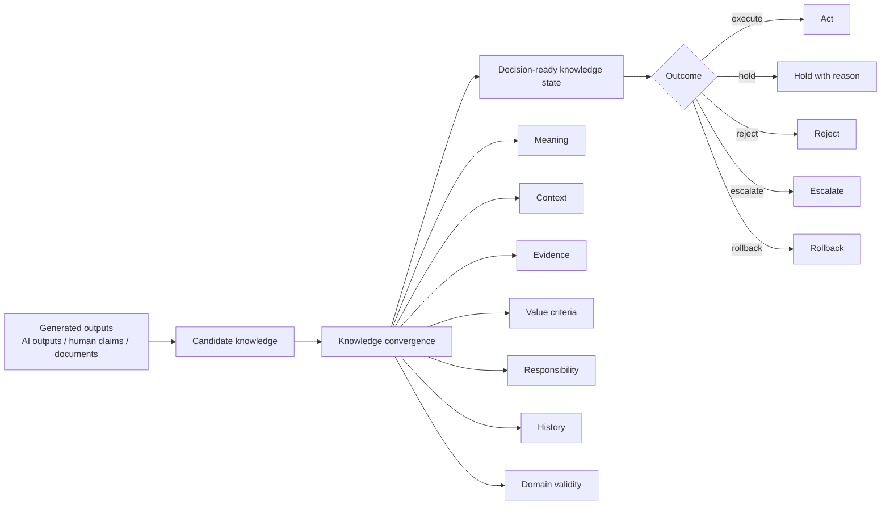

# Knowledge Convergence / 知識収束学

**Tagline:** A framework for turning generated outputs into decision-ready knowledge.

Knowledge Convergence is a theory and engineering framework for turning generated outputs, human claims, evidence, decisions, and operational feedback into knowledge states that an organization can reason about, govern, and act on.

In AI-era development, the main problem is not only whether AI can generate text, code, requirements, plans, or summaries. The harder problem is whether those outputs can be trusted, reviewed, assigned to responsible actors, validated in a domain, and safely executed.

**Generated output is not knowledge.**

Knowledge Convergence treats AI outputs, human statements, documents, models, and test results as **candidates**. A candidate becomes usable knowledge only when it is connected to meaning, context, evidence, value criteria, responsibility, history, and domain validity.



## Why this matters

AI lowers the cost of generation. It does not remove the cost of judgment.

Organizations still need to decide:

- Is this true enough for the intended use?
- What evidence supports it?
- Which context does it apply to?
- Who is responsible for approving, executing, stopping, or rolling it back?
- What value criteria should be used?
- What happens if the assumption is wrong?
- Has the result been validated in the target domain?

Knowledge Convergence addresses this gap between **generation** and **accountable use**.

## Core idea

A knowledge state is represented as:

```text
K = (G, C, E, V, R, H)
```

| Symbol | Meaning | Plain explanation |
|---|---|---|
| `G` | Meaning structure | What is being claimed, modeled, decided, or related |
| `C` | Context | Where, when, and under what assumptions it applies |
| `E` | Evidence | What supports it |
| `V` | Value criteria | What it is judged against |
| `R` | Responsibility and authority | Who can decide, execute, review, stop, or rollback |
| `H` | History | How it changed, why it changed, and what was approved |

Version 1.1 adds explicit support for:

- domain validity convergence
- AI agent execution governance
- meaningful human oversight
- organization topology
- convergence metrics
- Systems Engineering use cases

## Three-layer convergence

Knowledge Convergence v1.1 evaluates knowledge states through three layers:

1. **Epistemic convergence** — Can the content be explained with meaning, context, evidence, and uncertainty?
2. **Governance convergence** — Can the organization decide, approve, hold, reject, escalate, execute, or rollback it responsibly?
3. **Domain validity convergence** — Is it valid enough for the target domain, operational environment, and intended use?

Convergence does **not** mean forcing everyone into one answer. It means reaching a state where an accountable branch can be selected: execute, hold, reject, escalate, reopen, or rollback.

## Relation to AI agents

Modern AI agents may generate, edit, execute commands, call tools, create tickets, or operate existing applications. Knowledge Convergence treats agents as **bounded execution actors**, not as automatic authorities.

An AI agent action should be governed by:

- agent identity
- owner role
- authority envelope
- tool scope
- data access scope
- review gate
- audit log
- stop condition
- rollback path

## Relation to Systems Engineering

The SE System extension applies Knowledge Convergence to the work that must happen before code is written and beyond code execution:

- stakeholder needs
- system boundary
- operational scenarios
- requirements
- constraints
- architecture decisions
- trade-offs
- verification
- validation
- human and organization roles
- AI coding delegation
- change impact

An SE System is not a SysML tool and not an AI coding tool. It is a decision and knowledge infrastructure for deciding what should be built, why it should be built, under what constraints, by whom, and how it will be verified and validated.

## Repository map

| Path | Purpose |
|---|---|
| `01_core/` | Core theory, public contract, schemas, and examples |
| `06_public_annex/` | Public supplementary annex |
| `07_foundational_annex/` | Foundational annex for language, mathematics, and temporality |
| `08_institutional_annex/` | Institutional operation, governance, consensus, and HCI annex |
| `09_conformance_suite/` | Rulebook, test vectors, schemas, and validation runner |
| `10_se_system_annex/` | Systems Engineering extension |
| `11_core_revision_annex/` | v1.1 revision rationale and migration notes |
| `docs/en/` | Human-readable English guides |
| `docs/ja/` | Human-readable Japanese guides |
| `diagrams/` | Mermaid diagrams |
| `examples/public/` | Beginner-friendly public examples |

## Start here

| Reader | Recommended starting point |
|---|---|
| New readers | [`docs/en/00_introduction_for_beginners.md`](docs/en/00_introduction_for_beginners.md) |
| AI researchers | [`docs/en/11_for_ai_researchers.md`](docs/en/11_for_ai_researchers.md) |
| Systems Engineering users | [`docs/en/12_for_systems_engineers.md`](docs/en/12_for_systems_engineers.md) |
| Implementers | [`01_core/implementation_quickstart_public_v1.md`](01_core/implementation_quickstart_public_v1.md) |
| Conformance users | [`09_conformance_suite/00_start_here_conformance_suite.md`](09_conformance_suite/00_start_here_conformance_suite.md) |
| Japanese readers | [`README.ja.md`](README.ja.md) |

## Minimal example

A team asks an AI coding agent to implement a change. The agent can write code, but the SE System first checks:

- Is the requirement approved?
- Is the decision rationale recorded?
- Is the validation scenario defined?
- Is the agent allowed to edit the target repository?
- Is there a review gate?
- Is rollback defined?

If a required condition is missing, the correct outcome is not automatic execution. The correct outcome may be **hold** with a reason.

## Status

This repository is an early public specification and research framework. It is intended for discussion, implementation experiments, Systems Engineering tool design, AI agent governance research, and conformance tooling.

It should **not** be treated as a mature industrial standard.

## Language

- English: this file
- Japanese: [`README.ja.md`](README.ja.md)

## License

This repository is publicly readable, but it is not open source. Modification, derivative works, redistribution, republication, and mirroring require prior written permission. See [`LICENSE`](LICENSE).
