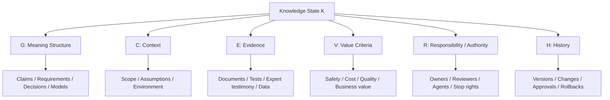

# Core Concepts

Knowledge Convergence represents a decision-ready knowledge state as:

```text
K = (G, C, E, V, R, H)
```

This does not mean every artifact must be fully formalized. It means that a usable knowledge state should explicitly connect the following dimensions.

| Symbol | Meaning | Plain explanation |
|---|---|---|
| `G` | Meaning structure | What is being claimed, modeled, related, or decided |
| `C` | Context | Where, when, and under what assumptions it applies |
| `E` | Evidence | What supports it |
| `V` | Value criteria | What it is judged against |
| `R` | Responsibility and authority | Who can decide, execute, review, stop, or rollback |
| `H` | History | How it changed, why it changed, and what was approved |



## Candidate knowledge

Candidate knowledge is information that may become usable knowledge but is not ready yet.

Examples:

- an AI-generated requirement
- a meeting note
- a code change proposal
- a domain expert comment
- a test result
- a customer statement

## Decision-ready knowledge

Decision-ready knowledge is a state where an organization can responsibly select a branch:

- execute
- hold
- reject
- escalate
- reopen
- rollback

Decision-ready does not mean perfect. It means the remaining uncertainty, responsibility, evidence, and domain conditions are explicit enough for accountable action.

## Domain validity

Version 1.1 adds domain validity as a first-class concern.

A claim may be understandable and approved, but still not valid for its target domain. For example, a requirement may be approved but lack a validation scenario. A code change may pass tests but fail intended operational use.

Domain validity checks whether the knowledge state is usable in the target environment and discipline.
