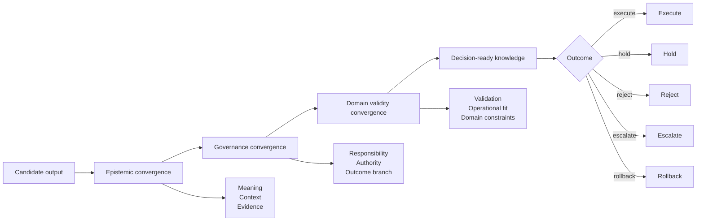

# Three-Layer Convergence

Knowledge Convergence v1.1 evaluates knowledge states through three layers.

## 1. Epistemic convergence

Epistemic convergence asks whether the content is explainable.

Typical checks:

- Is the claim clear?
- Is the context specified?
- Is the evidence linked?
- Are assumptions visible?
- Are contradictions or uncertainties recorded?

## 2. Governance convergence

Governance convergence asks whether the organization can handle the state responsibly.

Typical checks:

- Who owns the decision?
- Who has authority to approve?
- Who can stop or rollback execution?
- Which branch is selected?
- Is a hold reason recorded?
- Is an audit trail available?

## 3. Domain validity convergence

Domain validity convergence asks whether the state is valid enough for the target domain.

Typical checks:

- Has the requirement been validated against intended use?
- Does the decision satisfy safety, quality, cost, or operational constraints?
- Is the AI agent allowed to perform the requested action?
- Does the proposed action have a rollback path?
- Does the result still hold under relevant assumptions?

## Why three layers are necessary

A knowledge state can be explainable but not approved.

A knowledge state can be approved but not valid for the domain.

A knowledge state can pass tests but fail intended operational use.

The three-layer model prevents these cases from being collapsed into a single vague notion of correctness.
