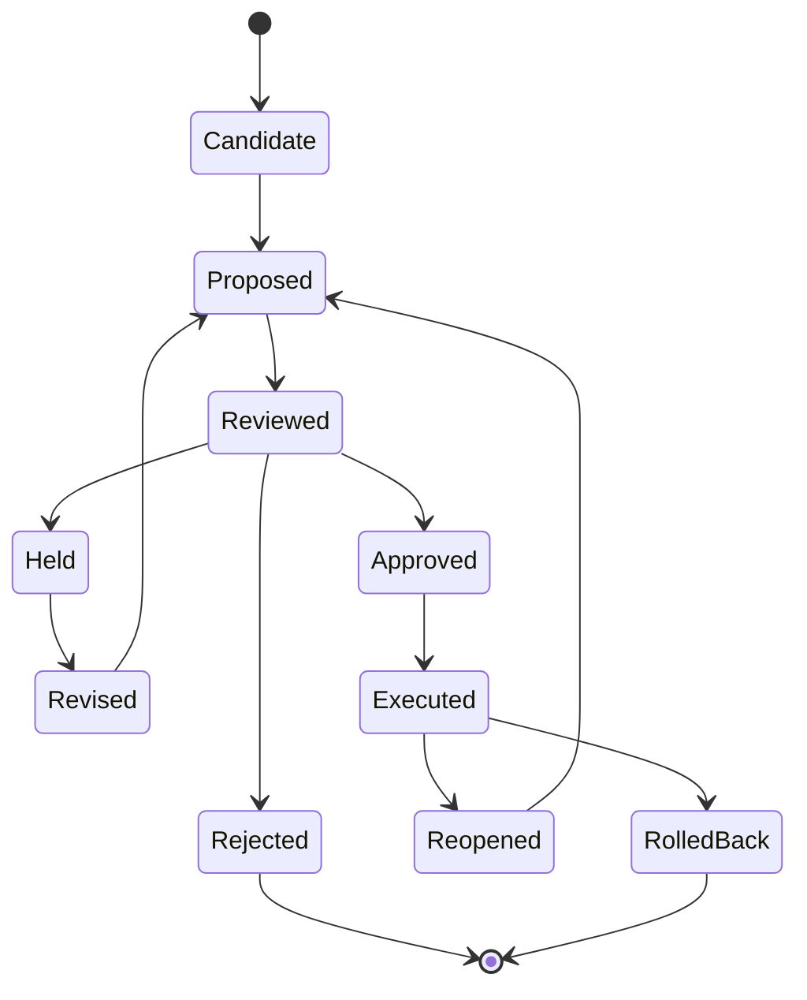

# Knowledge State Model

A knowledge state is not a document. It is a structured state that connects claims, evidence, context, values, responsibility, and history.

## Basic model

```text
K = (G, C, E, V, R, H)
```

In practice, `K` may be represented by documents, graphs, schemas, tables, models, diagrams, or code. The important point is not the storage format. The important point is that the required relationships are explicit enough to support decisions.

## Typical entities

A knowledge state may include:

- claim
- requirement
- decision
- assumption
- constraint
- risk
- evidence
- value criterion
- actor
- role
- authority
- validation item
- verification item
- history event
- outcome branch

## Typical relationships

Examples:

```text
claim supportedBy evidence
requirement derivedFrom need
decision selects option
decision rejects option
decision justifiedBy rationale
requirement verifiedBy verification_item
need validatedBy validation_scenario
agent_action boundedBy authority_envelope
change impacts requirement
```

## State transitions

A candidate may move through the following lifecycle.



## Why this matters

Without a state model, AI-generated artifacts become hard to govern. Teams may confuse a draft with an approved decision, a plausible answer with evidence, or a test pass with validation.

The knowledge state model makes these distinctions explicit.
