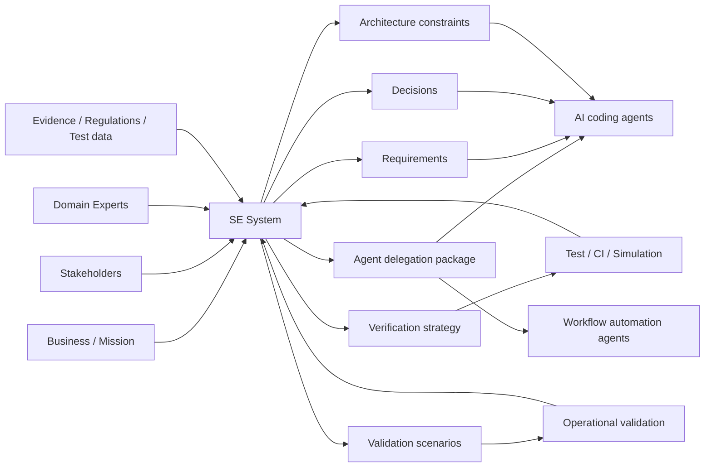

# SE System: Knowledge Convergence for Systems Engineering

An SE System applies Knowledge Convergence to Systems Engineering.

It is not a SysML tool and not an AI coding tool. It is a decision and knowledge infrastructure for deciding:

- what should be built
- why it should be built
- under what constraints
- with whose responsibility
- how it will be verified
- how it will be validated
- what happens when assumptions change

## Why code-first AI is not enough

AI coding agents can produce implementation artifacts. They can write code, modify files, create tests, and prepare pull requests.

But they do not automatically solve upstream decisions:

- Who are the stakeholders?
- What is the operational scenario?
- Where is the system boundary?
- Which requirements are valid?
- Which constraints are hard constraints?
- Which trade-off should be selected?
- How should the system be verified?
- How should the system be validated?
- Who is responsible for the decision?

These decisions exist before code and often cannot be resolved by writing code.

## SE System scope

## Core SE artifacts

An SE System should manage:

- stakeholder needs
- operational scenarios
- system boundary
- assumptions
- constraints
- requirements
- architecture decisions
- trade-offs
- verification items
- validation scenarios
- risks
- human roles
- AI agent delegations
- change impact

## Representation policy

The SE System does not require SysML as a prerequisite.

It may use:

- natural language
- structured natural language
- tables
- matrices
- diagrams
- DSLs
- formal specifications
- simulation models
- tests
- code

The canonical object is not a diagram. The canonical object is the knowledge state.

## Minimum useful SE System

A minimal SE System should provide:

1. evidence-backed decision ledger
2. requirement / verification / validation graph
3. SE lint
4. AI delegation envelope
5. change impact view
6. human and organization role model

## Main value

The main value of an SE System is not to generate more documents.

The main value is to reduce wrong execution, unvalidated requirements, hidden assumptions, weak decisions, and unsafe AI delegation.
