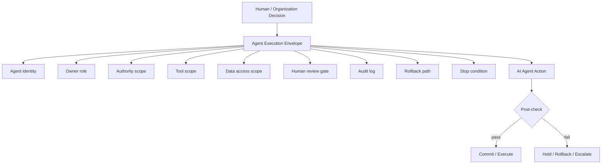

# AI Agent Governance

AI agents are no longer only text generators. They may edit files, run commands, call tools, operate browsers, create tickets, update documents, and trigger workflows.

Knowledge Convergence treats AI agents as **bounded execution actors**.

## From output validation to delegation governance

Traditional AI evaluation often focuses on output quality.

For AI agents, output quality is not enough. Teams must govern delegation:

- What is the agent allowed to do?
- Which tools can it use?
- Which data can it access?
- Who owns the agent action?
- Who reviews the result?
- What logs are required?
- When must execution stop?
- How can the action be rolled back?

## Agent execution envelope

## Required elements

An AI agent execution packet should include:

| Element | Purpose |
|---|---|
| agent identity | Identify which agent acted |
| owner role | Identify the accountable human or organization role |
| authority envelope | Define what the agent may do |
| tool scope | Limit callable tools and environments |
| data access scope | Limit what information the agent may read or write |
| review gate | Define when human or automated review is required |
| audit log | Record actions, inputs, outputs, and decisions |
| stop condition | Define when execution must stop |
| rollback path | Define how to reverse or contain the action |

## Important distinction

An AI agent may execute a task. That does not mean it owns the decision.

Responsibility must remain explicit in the knowledge state.

## Typical outcomes

- execute: all required conditions are satisfied
- hold: validation, authority, or evidence is missing
- escalate: risk or authority exceeds local scope
- rollback: executed action violates conditions
- reject: task should not be performed
