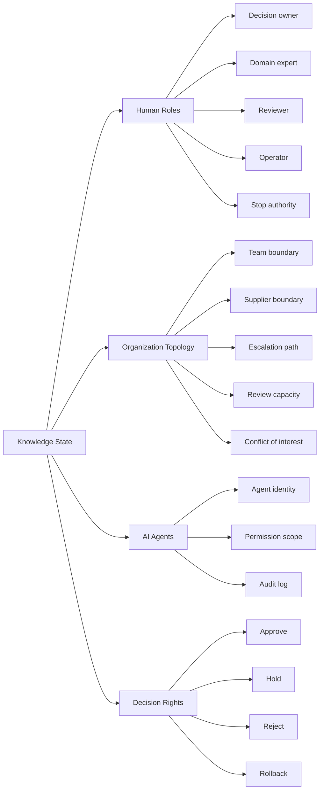

# Human and Organization Are Part of the System

Knowledge Convergence treats human roles and organization structure as part of the knowledge state, not as external assumptions.

This is especially important in AI-era systems, because AI can generate and execute faster than humans can review everything manually.

## Human-in-the-loop is not enough

A human approval step does not guarantee meaningful oversight.

A human can provide meaningful oversight only if the person:

- understands the decision
- has enough time
- has access to evidence
- has the required competence
- has authority to stop execution
- has an escalation path
- is not forced into symbolic approval

## Organization topology

Knowledge Convergence v1.1 represents organizational structure explicitly.

## Organizational elements

A knowledge state may include:

- decision owner
- accountable role
- domain expert
- reviewer
- operator
- stop authority
- escalation path
- supplier boundary
- conflict of interest
- review capacity
- backup role
- competence state

## Why this matters

Many failures are not caused only by incorrect technical information. They are caused by weak responsibility, missing review capacity, unclear authority, symbolic approval, or fragmented ownership.

Knowledge Convergence makes these conditions visible.
