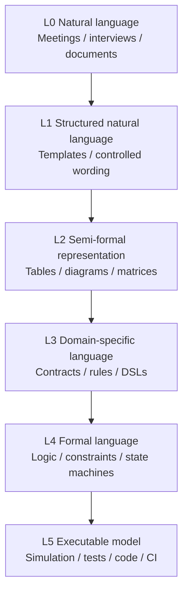

# Formalization Ladder

Knowledge Convergence does not require a specific modeling language.

It does not require SysML, a specific DSL, a specific database, or a specific software environment. It can use multiple representation levels depending on the situation.

## The ladder

| Level | Representation | Example |
|---|---|---|
| L0 | Natural language | interviews, meeting notes, user statements |
| L1 | Structured natural language | requirement templates, controlled wording |
| L2 | Semi-formal representation | tables, state diagrams, trace matrices |
| L3 | Domain-specific language | safety rule DSL, interface contract DSL |
| L4 | Formal language | temporal logic, constraints, state machines |
| L5 | Executable model | simulation, test harness, code, CI |

## Why not force full formalization?

Early-stage development often contains useful ambiguity. Business goals, stakeholder needs, operational scenarios, and trade-offs may not be ready for formal logic.

Forcing full formalization too early can hide uncertainty instead of reducing it.

## Why not stay in natural language?

Natural language alone is weak for:

- consistency checks
- traceability
- impact analysis
- verification planning
- agent delegation
- conformance testing

The ladder allows teams to increase formalization where it matters.

## Policy

Use the minimum formality that supports the required decision.

Do not formalize everything. Do not leave everything informal.
