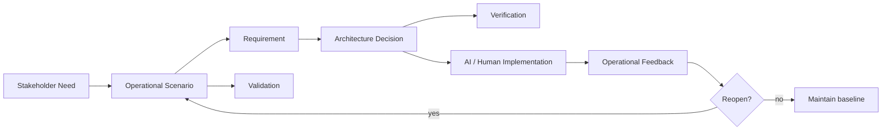

# For Systems Engineers

Knowledge Convergence helps Systems Engineering teams manage the work that must happen before code is written and the work that code alone cannot resolve.

## Problems addressed

Systems Engineering teams often face:

- requirements without evidence
- decisions without rationale
- verification without validation
- AI-generated artifacts without accountability
- cross-domain trade-offs
- organizational approval without actual understanding
- changes whose impact is unclear
- expert comments that are not connected to decisions
- implementation tasks that are not linked to approved requirements

Knowledge Convergence provides a way to represent and inspect these conditions.

## SE System view

An SE System uses Knowledge Convergence to manage:

- stakeholder needs
- operational scenarios
- requirements
- constraints
- architecture decisions
- trade-offs
- verification
- validation
- human roles
- AI agent delegation
- change impact



## What changes from document-centric SE

In document-centric SE, teams often manage specifications, slides, review minutes, and spreadsheets.

In a Knowledge Convergence-based SE System, those artifacts are views over a knowledge state.

The central question changes from:

```text
Is the document complete?
```

To:

```text
Is the knowledge state decision-ready, accountable, and domain-valid?
```

## Verification and validation

Knowledge Convergence separates verification and validation.

- Verification asks whether the system satisfies specified requirements.
- Validation asks whether the system satisfies intended use, stakeholder need, and operational value.

A requirement can be verified and still fail validation.

## Minimal SE System implementation

A practical starting point:

1. Decision Ledger
2. Requirement / Verification / Validation graph
3. SE Lint rules
4. AI delegation envelope
5. Change impact analysis
6. Human and organization role model

## Practical first use case

Start with one decision-heavy project area.

Capture:

- open issues
- options
- criteria
- selected option
- rejected options
- evidence
- assumptions
- owner
- validation scenario
- reopen condition

Then add lint rules for missing evidence, missing owner, missing validation, and missing rollback.
