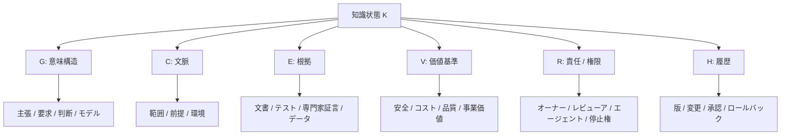

# 基本概念

知識収束学では、判断可能な知識状態を次のように表します。

```text
K = (G, C, E, V, R, H)
```

これは、すべての成果物を最初から完全に形式化するという意味ではありません。実務で使える知識状態には、次の次元が明示的に接続されているべきだ、という意味です。

| 記号 | 意味 | 平易な説明 |
|---|---|---|
| `G` | 意味構造 | 何についての主張・モデル・関係・判断か |
| `C` | 文脈 | どこで、いつ、どの前提で成り立つか |
| `E` | 根拠 | 何に支えられているか |
| `V` | 価値基準 | 何を基準に評価するか |
| `R` | 責任と権限 | 誰が判断・実行・レビュー・停止・ロールバックできるか |
| `H` | 履歴 | どう変わり、なぜ変わり、何が承認されたか |



## 知識候補

知識候補とは、知識になり得るが、まだ判断可能な状態ではない情報です。

例:

- AIが生成した要求案
- 議事録
- コード変更案
- ドメイン専門家のコメント
- テスト結果
- 顧客発言

## 判断可能な知識

判断可能な知識とは、組織が責任を持って次の分岐を選べる状態です。

- 実行
- 保留
- 棄却
- エスカレーション
- 再オープン
- ロールバック

判断可能とは、完全であるという意味ではありません。残る不確実性、責任、根拠、ドメイン条件が、責任ある行動に十分な程度で明示されている、という意味です。

## ドメイン妥当性

v1.1では、ドメイン妥当性を一級要素として追加しています。

ある主張は、内容として理解でき、組織として承認されていても、対象ドメインで妥当とは限りません。たとえば、要求が承認済みでも妥当性確認シナリオがない場合があります。コード変更がテストを通っても、意図した運用で失敗する場合があります。

ドメイン妥当性は、その知識状態が対象環境と専門領域で使えるかを確認します。
