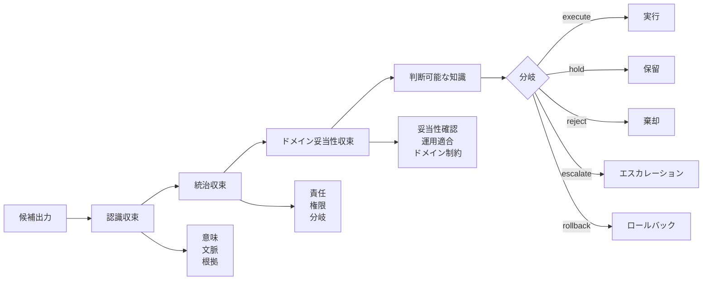

# 三層収束

知識収束学 v1.1 では、知識状態を三つの層で評価します。

## 1. 認識収束

認識収束は、内容として説明できるかを問います。

代表的な確認項目:

- 主張は明確か
- 文脈は指定されているか
- 根拠はリンクされているか
- 前提は可視化されているか
- 矛盾や不確実性は記録されているか

## 2. 統治収束

統治収束は、組織がその状態を責任を持って扱えるかを問います。

代表的な確認項目:

- 誰が判断オーナーか
- 誰が承認権限を持つか
- 誰が実行を停止・ロールバックできるか
- どの分岐が選ばれているか
- hold理由は記録されているか
- 監査証跡はあるか

## 3. ドメイン妥当性収束

ドメイン妥当性収束は、その状態が対象ドメインで使うのに十分妥当かを問います。

代表的な確認項目:

- 要求は意図した利用に対して妥当性確認されているか
- 判断は安全、品質、コスト、運用制約を満たすか
- AIエージェントは依頼された操作を実行してよいか
- 提案された操作にはロールバック経路があるか
- 関連する前提のもとで結果は維持されるか

## なぜ三層が必要か

知識状態は、説明可能でも承認されていない場合があります。

知識状態は、承認されていても対象ドメインで妥当ではない場合があります。

知識状態は、テストを通っても意図した運用では失敗する場合があります。

三層モデルは、これらを単一の曖昧な「正しさ」に潰さないために必要です。
