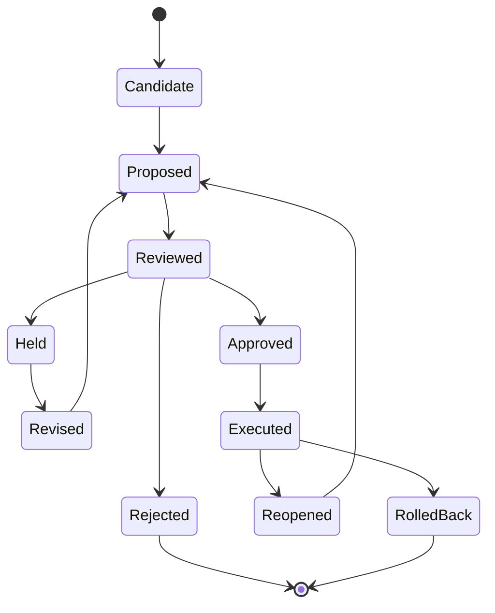

# 知識状態モデル

知識状態は、単なる文書ではありません。主張、根拠、文脈、価値基準、責任、履歴を接続した構造化状態です。

## 基本モデル

```text
K = (G, C, E, V, R, H)
```

実務では、`K` は文書、グラフ、schema、表、モデル、図、コードで表現される場合があります。重要なのは保存形式ではありません。意思決定を支えられる程度に、必要な関係が明示されていることです。

## 代表的な要素

知識状態には、次のような要素が含まれます。

- 主張
- 要求
- 判断
- 前提
- 制約
- リスク
- 根拠
- 価値基準
- アクター
- 役割
- 権限
- 妥当性確認項目
- 検証項目
- 履歴イベント
- 結果分岐

## 代表的な関係

例:

```text
claim supportedBy evidence
requirement derivedFrom need
decision selects option
decision rejects option
decision justifiedBy rationale
requirement verifiedBy verification_item
need validatedBy validation_scenario
agent_action boundedBy authority_envelope
change impacts requirement
```

## 状態遷移

候補は、次のようなライフサイクルを移動します。



## なぜ重要か

状態モデルがないと、AI生成物を統治しにくくなります。チームは、ドラフトと承認済み判断、もっともらしい回答と根拠、テスト合格と妥当性確認を混同しやすくなります。

知識状態モデルは、これらの区別を明示します。
