# SEシステム：システムズエンジニアリングへの知識収束学の適用

SEシステムは、知識収束学をシステムズエンジニアリングへ適用したものです。

SEシステムは、SysMLツールでもAIコーディングツールでもありません。SEシステムは、次を決めるための意思決定・知識基盤です。

- 何を作るべきか
- なぜ作るべきか
- どの制約で作るべきか
- 誰の責任で進めるか
- どう検証するか
- どう妥当性確認するか
- 前提が変わったときに何を再検討するか

## なぜコード先行AIだけでは足りないか

AIコーディングエージェントは、実装成果物を作れます。コードを書き、ファイルを修正し、テストを作り、プルリクエストを準備できます。

しかし、上流の判断を自動的に解決するわけではありません。

- ステークホルダは誰か
- 運用シナリオは何か
- システム境界はどこか
- どの要求が妥当か
- どの制約が絶対制約か
- どのトレードオフを選ぶべきか
- システムをどう検証するか
- システムをどう妥当性確認するか
- 誰が判断責任を持つか

これらの判断はコードより前に存在し、コードを書くことでは解決しない場合が多いです。

## SEシステムの範囲

```mermaid
flowchart LR
    A[事業 / ミッション] --> B[SEシステム]
    C[ステークホルダ] --> B
    D[ドメイン専門家] --> B
    E[根拠 / 規格 / テストデータ] --> B

    B --> F[要求]
    B --> G[判断]
    B --> H[アーキテクチャ制約]
    B --> I[検証戦略]
    B --> J[妥当性確認シナリオ]
    B --> K[エージェント委任パッケージ]

    K --> L[AIコーディングエージェント]
    K --> M[業務自動化エージェント]
    F --> L
    G --> L
    H --> L
    I --> N[テスト / CI / シミュレーション]
    J --> O[運用での妥当性確認]

    O --> B
    N --> B
```

## SEシステムが扱う主要成果物

SEシステムは、次を管理します。

- ステークホルダニーズ
- 運用シナリオ
- システム境界
- 前提
- 制約
- 要求
- アーキテクチャ判断
- トレードオフ
- 検証項目
- 妥当性確認シナリオ
- リスク
- 人間の役割
- AIエージェント委任
- 変更影響

## 表現方針

SEシステムは、SysMLを前提にしません。

次の表現を使い分けます。

- 自然言語
- 構造化自然言語
- 表
- マトリクス
- 図
- DSL
- 形式仕様
- シミュレーションモデル
- テスト
- コード

正本は図ではありません。正本は知識状態です。

## 最小有用SEシステム

最小構成のSEシステムは、次を提供するべきです。

1. 根拠付きDecision Ledger
2. 要求 / 検証 / 妥当性確認グラフ
3. SE Lint
4. AI委任包絡
5. 変更影響ビュー
6. 人間・組織の役割モデル

## 主な価値

SEシステムの主な価値は、文書をさらに生成することではありません。

主な価値は、誤った実行、未妥当性確認の要求、隠れた前提、弱い判断、危険なAI委任を減らすことです。
