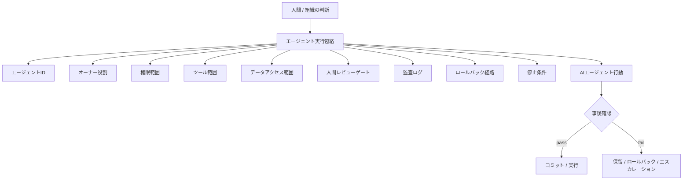

# AIエージェント統治

AIエージェントは、もはや文章生成器だけではありません。ファイル編集、コマンド実行、ツール呼び出し、ブラウザ操作、チケット作成、文書更新、ワークフロー起動を行う場合があります。

知識収束学では、AIエージェントを **限定された実行主体** として扱います。

## 出力検証から委任統治へ

従来のAI評価は、出力品質に注目することが多いです。

AIエージェントでは、出力品質だけでは足りません。チームは委任を統治する必要があります。

- エージェントは何をしてよいか
- どのツールを使ってよいか
- どのデータへアクセスしてよいか
- 誰がエージェント行動の責任を持つか
- 誰が結果をレビューするか
- どのログが必要か
- いつ実行を停止すべきか
- どうロールバックするか

## エージェント実行包絡

## 必須要素

AIエージェント実行パケットには、次を含めるべきです。

| 要素 | 目的 |
|---|---|
| エージェントID | どのエージェントが行動したかを特定する |
| オーナー役割 | 責任を持つ人間または組織役割を特定する |
| 権限包絡 | エージェントが何をしてよいかを定義する |
| ツール範囲 | 呼び出し可能なツールと環境を制限する |
| データアクセス範囲 | 読み書き可能な情報を制限する |
| レビューゲート | 人間または自動レビューが必要な条件を定義する |
| 監査ログ | 行動、入力、出力、判断を記録する |
| 停止条件 | 実行を停止すべき条件を定義する |
| ロールバック経路 | 行動を戻す、または影響を封じ込める方法を定義する |

## 重要な区別

AIエージェントはタスクを実行できます。しかし、AIエージェントが意思決定責任を持つとは限りません。

責任は、知識状態の中で明示される必要があります。

## 代表的な分岐

- execute: 必要条件を満たしている
- hold: 妥当性、権限、根拠が不足している
- escalate: リスクまたは権限が局所範囲を超えている
- rollback: 実行済み行動が条件に違反している
- reject: 実行すべきではない
