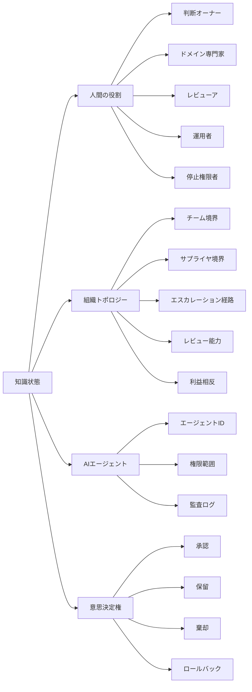

# 人間と組織はシステムの外部条件ではない

知識収束学では、人間の役割と組織構造を、外部前提ではなく知識状態の一部として扱います。

これはAI時代のシステムで特に重要です。AIは、人間がすべてを手作業でレビューできる速度を超えて、生成・実行できるからです。

## Human-in-the-loop だけでは足りない

人間の承認ステップがあるだけでは、意味ある監督は保証されません。

人間が意味ある監督を行うには、その人が次を満たす必要があります。

- 判断内容を理解できる
- 十分な時間がある
- 根拠へアクセスできる
- 必要な能力を持つ
- 実行を停止する権限がある
- エスカレーション経路がある
- 形式的承認に追い込まれていない

## 組織トポロジー

知識収束学 v1.1 では、組織構造を明示的に表現します。

## 組織要素

知識状態には、次が含まれます。

- 判断オーナー
- 説明責任を持つ役割
- ドメイン専門家
- レビューア
- 運用者
- 停止権限者
- エスカレーション経路
- サプライヤ境界
- 利益相反
- レビュー能力
- バックアップ役割
- 能力状態

## なぜ重要か

多くの失敗は、技術情報の誤りだけで起きるわけではありません。責任の弱さ、レビュー能力不足、権限の曖昧さ、形式的承認、所有権の分断によって起きます。

知識収束学は、これらの条件を可視化します。
