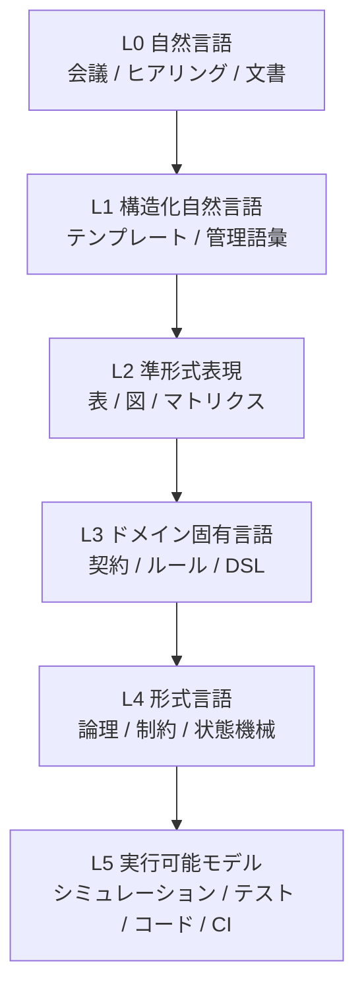

# 形式化の階段

知識収束学は、特定のモデリング言語を前提にしません。

SysML、特定DSL、特定データベース、特定ソフトウェア環境を必須にしません。状況に応じて、複数の表現レベルを使い分けます。

## 階段

| レベル | 表現 | 例 |
|---|---|---|
| L0 | 自然言語 | ヒアリング、議事録、利用者発言 |
| L1 | 構造化自然言語 | 要求テンプレート、管理語彙 |
| L2 | 準形式表現 | 表、状態遷移図、トレースマトリクス |
| L3 | ドメイン固有言語 | 安全ルールDSL、インターフェース契約DSL |
| L4 | 形式言語 | 時相論理、制約、状態機械 |
| L5 | 実行可能モデル | シミュレーション、テストハーネス、コード、CI |

## なぜ最初から完全形式化しないか

初期開発には、有用な曖昧さがあります。事業目標、ステークホルダニーズ、運用シナリオ、トレードオフは、最初から形式論理に落とせるとは限りません。

早すぎる完全形式化は、不確実性を減らすのではなく、隠す場合があります。

## なぜ自然言語だけでは足りないか

自然言語だけでは、次が弱くなります。

- 整合性チェック
- トレーサビリティ
- 影響分析
- 検証計画
- エージェント委任
- 適合検査

形式化の階段は、必要な場所で形式化を上げるための考え方です。

## 方針

必要な判断を支える最小限の形式性を使います。

すべてを形式化しない。すべてを非形式のままにも残さない。
