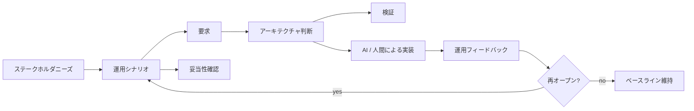

# SE利用者向け

知識収束学は、コードを書く前に必要な仕事と、コードだけでは解決できない仕事を、システムズエンジニアリングチームが扱うために役立ちます。

## 扱う問題

システムズエンジニアリングのチームは、次の問題に直面しがちです。

- 根拠のない要求
- 理由のない判断
- 妥当性確認のない検証
- 説明責任のないAI生成成果物
- 複数ドメインにまたがるトレードオフ
- 実質理解のない組織承認
- 影響範囲が曖昧な変更
- 判断に接続されない専門家コメント
- 承認済み要求に紐づかない実装タスク

知識収束学は、これらの条件を表現・検査する方法を提供します。

## SEシステムの見方

SEシステムは、知識収束学を使って次を管理します。

- ステークホルダニーズ
- 運用シナリオ
- 要求
- 制約
- アーキテクチャ判断
- トレードオフ
- 検証
- 妥当性確認
- 人間の役割
- AIエージェント委任
- 変更影響



## 文書中心SEから何が変わるか

文書中心SEでは、仕様書、スライド、レビュー議事録、表を管理することが多いです。

知識収束学に基づくSEシステムでは、それらの成果物は知識状態のビューです。

中心の問いは、次から変わります。

```text
文書は完成しているか
```

次へ変わります。

```text
知識状態は、判断可能で、責任を持てて、対象ドメインで妥当か
```

## Verification と Validation

知識収束学は、Verification と Validation を分けます。

- Verification は、システムが指定要求を満たすかを問います。
- Validation は、システムが意図した利用、ステークホルダニーズ、運用価値を満たすかを問います。

要求は、検証に合格しても妥当性確認に失敗する場合があります。

## 最小SEシステム実装

実務の出発点は次です。

1. Decision Ledger
2. 要求 / 検証 / 妥当性確認グラフ
3. SE Lint規則
4. AI委任包絡
5. 変更影響分析
6. 人間・組織の役割モデル

## 最初の適用例

判断が多いプロジェクト領域を一つ選びます。

次を記録します。

- 未決事項
- 選択肢
- 評価基準
- 採用案
- 却下案
- 根拠
- 前提
- オーナー
- 妥当性確認シナリオ
- 再オープン条件

その後、根拠不足、オーナー不在、妥当性確認不足、ロールバック不足を検出するLint規則を追加します。
